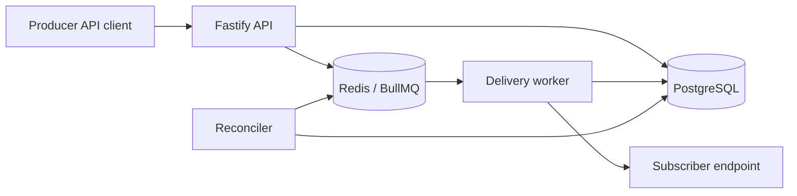

# Herald Architecture

Herald accepts events from authenticated tenants and turns each event into one delivery per matching endpoint. PostgreSQL stores tenants, endpoints, events, deliveries, and attempts. Redis/BullMQ schedules delivery work, but PostgreSQL remains the source of truth.

The transactional-outbox flow is deliberately lightweight:

1. Insert the event and delivery rows in a PostgreSQL transaction.
2. After commit, enqueue delivery jobs in Redis.
3. Run a reconciler that re-enqueues stale pending or failed deliveries.

That keeps delivery state recoverable if the process or Redis dies between database write and queue enqueue.
